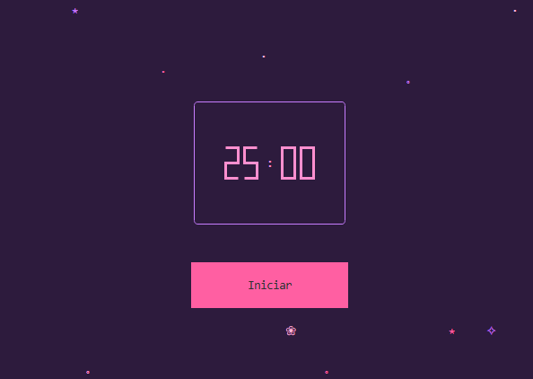

# ⋆｡˚ Pomodoro Barbie ˚｡⋆

Um timer Pomodoro para o terminal, com estética rosa e roxo. Feito com [Textual](https://textual.textualize.io/).

`✧ ⋆ ˚ ♡ ˚ ⋆ ✧ ⋆ ˚ ♡ ˚ ⋆ ✧ ⋆ ˚ ♡ ˚ ⋆ ✧ ✧ ⋆ ˚ ♡ ˚ ⋆ ✧ ⋆ ˚ ♡ ˚ ⋆ ✧ ⋆ ˚ ♡ ˚ ⋆ ✧ ⋆ ˚ ♡ ˚ ⋆ ✧ ⋆ ˚ ♡ ˚ ⋆ ✧ ⋆ ˚ `

<p align="left">
  
</p>

`✧ ⋆ ˚ ♡ ˚ ⋆ ✧ ⋆ ˚ ♡ ˚ ⋆ ✧ ⋆ ˚ ♡ ˚ ⋆ ✧ ✧ ⋆ ˚ ♡ ˚ ⋆ ✧ ⋆ ˚ ♡ ˚ ⋆ ✧ ⋆ ˚ ♡ ˚ ⋆ ✧ ⋆ ˚ ♡ ˚ ⋆ ✧ ⋆ ˚ ♡ ˚ ⋆ ✧ ⋆ ˚ `


## ⟡ O que ele faz

- Contagem regressiva de 25 minutos (o clássico ciclo Pomodoro de foco)
- Botão que alterna entre **Iniciar** e **Pausar**
- Volta sozinho para 25:00 quando o tempo zera
- Fundo com dezenas de estrelas, corações e flores que piscam trocando de cor, cada uma no seu próprio ritmo
- Paleta rosa e roxo, com moldura arredondada no relógio

`✧ ⋆ ˚ ♡ ˚ ⋆ ✧ ⋆ ˚ ♡ ˚ ⋆ ✧ ⋆ ˚ ♡ ˚ ⋆ ✧ ✧ ⋆ ˚ ♡ ˚ ⋆ ✧ ⋆ ˚ ♡ ˚ ⋆ ✧ ⋆ ˚ ♡ ˚ ⋆ ✧ ⋆ ˚ ♡ ˚ ⋆ ✧ ⋆ ˚ ♡ ˚ ⋆ ✧ ⋆ ˚ `

## ⟡ Pré-requisitos

- **Python 3.8 ou superior** instalado
- Um terminal (o do sistema, o do VS Code, ou o do cyberdeck)

Para os cantos arredondados e os símbolos aparecerem perfeitos, o ideal é usar uma **[Nerd Font](https://www.nerdfonts.com/)** no terminal (ex.: *JetBrainsMono Nerd Font*). Sem ela, funciona igual — só os cantos ficam mais retos e alguns símbolos podem virar quadradinhos.

`✧ ⋆ ˚ ♡ ˚ ⋆ ✧ ⋆ ˚ ♡ ˚ ⋆ ✧ ⋆ ˚ ♡ ˚ ⋆ ✧ ✧ ⋆ ˚ ♡ ˚ ⋆ ✧ ⋆ ˚ ♡ ˚ ⋆ ✧ ⋆ ˚ ♡ ˚ ⋆ ✧ ⋆ ˚ ♡ ˚ ⋆ ✧ ⋆ ˚ ♡ ˚ ⋆ ✧ ⋆ ˚ `

## ⟡ Como baixar

Clone o repositório (ou baixe os arquivos `pomodoro.py` e `pomodoro.tcss` para a mesma pasta):

```bash
git clone <https://github.com/MariaRitaRR/timer-pomodoro-barbie>
cd timer-pomodoro-barbie
```

`✧ ⋆ ˚ ♡ ˚ ⋆ ✧ ⋆ ˚ ♡ ˚ ⋆ ✧ ⋆ ˚ ♡ ˚ ⋆ ✧ ✧ ⋆ ˚ ♡ ˚ ⋆ ✧ ⋆ ˚ ♡ ˚ ⋆ ✧ ⋆ ˚ ♡ ˚ ⋆ ✧ ⋆ ˚ ♡ ˚ ⋆ ✧ ⋆ ˚ ♡ ˚ ⋆ ✧ ⋆ ˚ `

## ⟡ Como rodar no Windows

Abra o **PowerShell** na pasta do projeto e siga os passos.

**1. Crie um ambiente virtual** (isola as dependências do projeto):

```powershell
python -m venv .venv
```

**2. Permita a ativação de scripts** (só na primeira vez, nesta sessão):

```powershell
Set-ExecutionPolicy -Scope Process -ExecutionPolicy RemoteSigned
```

**3. Ative o ambiente virtual:**

```powershell
.venv\Scripts\Activate.ps1
```

Você verá `(.venv)` no começo da linha.

**4. Instale o Textual:**

```powershell
pip install textual
```

**5. Rode o timer:**

```powershell
python pomodoro.py
```

> Se o comando `textual` não for reconhecido depois, não tem problema — usar `python pomodoro.py` funciona igual.

`✧ ⋆ ˚ ♡ ˚ ⋆ ✧ ⋆ ˚ ♡ ˚ ⋆ ✧ ⋆ ˚ ♡ ˚ ⋆ ✧ ✧ ⋆ ˚ ♡ ˚ ⋆ ✧ ⋆ ˚ ♡ ˚ ⋆ ✧ ⋆ ˚ ♡ ˚ ⋆ ✧ ⋆ ˚ ♡ ˚ ⋆ ✧ ⋆ ˚ ♡ ˚ ⋆ ✧ ⋆ ˚ `

## ⟡ Como rodar no Linux

Abra o **terminal** na pasta do projeto.

**1. Crie um ambiente virtual:**

```bash
python3 -m venv .venv
```

**2. Ative o ambiente virtual:**

```bash
source .venv/bin/activate
```

Você verá `(.venv)` no começo da linha.

**3. Instale o Textual:**

```bash
pip install textual
```

**4. Rode o timer:**

```bash
python pomodoro.py
```

`✧ ⋆ ˚ ♡ ˚ ⋆ ✧ ⋆ ˚ ♡ ˚ ⋆ ✧ ⋆ ˚ ♡ ˚ ⋆ ✧ ✧ ⋆ ˚ ♡ ˚ ⋆ ✧ ⋆ ˚ ♡ ˚ ⋆ ✧ ⋆ ˚ ♡ ˚ ⋆ ✧ ⋆ ˚ ♡ ˚ ⋆ ✧ ⋆ ˚ ♡ ˚ ⋆ ✧ ⋆ ˚ `

## ⟡ Como usar

- Clique em **Iniciar** para começar a contagem de 25 minutos
- Clique em **Pausar** para pausar; clique de novo para retomar
- Quando chegar a 00:00, o timer volta automaticamente para 25:00
- Para sair, pressione **Ctrl + Q**

`✧ ⋆ ˚ ♡ ˚ ⋆ ✧ ⋆ ˚ ♡ ˚ ⋆ ✧ ⋆ ˚ ♡ ˚ ⋆ ✧ ✧ ⋆ ˚ ♡ ˚ ⋆ ✧ ⋆ ˚ ♡ ˚ ⋆ ✧ ⋆ ˚ ♡ ˚ ⋆ ✧ ⋆ ˚ ♡ ˚ ⋆ ✧ ⋆ ˚ ♡ ˚ ⋆ ✧ ⋆ ˚ `

## ⟡ Personalização

Tudo é fácil de mexer:

| O que mudar | Onde |
|---|---|
| Duração do timer | `total = reactive(1500.0)` no `pomodoro.py` (valor em segundos) |
| Quantidade de estrelas | `range(50)` no método `compose` |
| Espalhamento das estrelas | faixas do `random.randint(...)` no `compose` |
| Símbolos usados | lista `CARACTERES` no topo do `pomodoro.py` |
| Cores que piscam | lista `cores` na classe `Sparkle` |
| Cores do fundo, relógio e botão | `pomodoro.tcss` |
| Velocidade do piscar | `random.uniform(0.3, 1.2)` na classe `Sparkle` |

`✧ ⋆ ˚ ♡ ˚ ⋆ ✧ ⋆ ˚ ♡ ˚ ⋆ ✧ ⋆ ˚ ♡ ˚ ⋆ ✧ ✧ ⋆ ˚ ♡ ˚ ⋆ ✧ ⋆ ˚ ♡ ˚ ⋆ ✧ ⋆ ˚ ♡ ˚ ⋆ ✧ ⋆ ˚ ♡ ˚ ⋆ ✧ ⋆ ˚ ♡ ˚ ⋆ ✧ ⋆ ˚ `

## ⟡ Feito com

- [Python](https://www.python.org/)
- [Textual](https://textual.textualize.io/) — framework de interfaces para terminal

`✧ ⋆ ˚ ♡ ˚ ⋆ ✧ ⋆ ˚ ♡ ˚ ⋆ ✧ ⋆ ˚ ♡ ˚ ⋆ ✧ ✧ ⋆ ˚ ♡ ˚ ⋆ ✧ ⋆ ˚ ♡ ˚ ⋆ ✧ ⋆ ˚ ♡ ˚ ⋆ ✧ ⋆ ˚ ♡ ˚ ⋆ ✧ ⋆ ˚ ♡ ˚ ⋆ ✧ ⋆ ˚ `

`˚ ⋆ ｡ ˚ ♡ feito com carinho para o cyberdeck ♡ ˚ ｡ ⋆ ˚`
